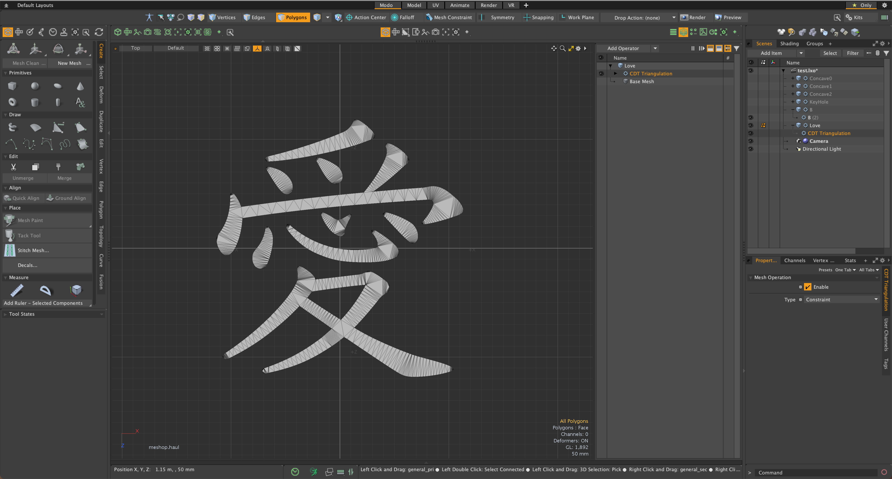

# CDT Triangulation for Modo plug-in
This a Modo Plug-in kit to triangulate polygons using Constraint Delaunay Triangulation algorithm.

This kit contains a command plugin and a procedural mesh operator for macOS and Windows.

This kit is implemented using CDT libraray.

https://artem-ogre.github.io/CDT/  


<div align="left">

</div>


## Installing
- Download lpk from releases. Drag and drop into your Modo viewport. If you're upgrading, delete previous version.

## How to use the plugins
- The command version of CDT Traingulation can be launched from "Kits" button on Modo UI at right-up. "poly.cdt" command is mapped at "T" button.  
- The procedural mesh operator version is available on Mesh Operator viewport. That is categorized in Polygon tab.
<div align="left">

</div>

## Type Option
- **Constrained Delaunay Triangulations**: force edges into Delaunay triangulation
- **Conforming Delaunay Triangulations**: add new points into Delaunay triangulation until the edge is present in triangulation

## Building codes

- LXSDK
This kit requires Modo SDK (Modo 16.1v8 or later). Download and build LXSDK and set you LXSDK path to LXSDK_PATH in CMakeLists.txt in triagulate.
- CDT library.
This also requires CDT library. Download and build CDT from below and set the include and library path to CMakeLists.txt in triagulate.

## License

```
This software is based part on CDT (C++ library for constrained Delaunay triangulation):
Copyright © 2019 Leica Geosystems Technology AB
Copyright © The CDT Contributors
Licensed under the MPL-2.0 license.
https://github.com/artem-ogre/CDT
```
