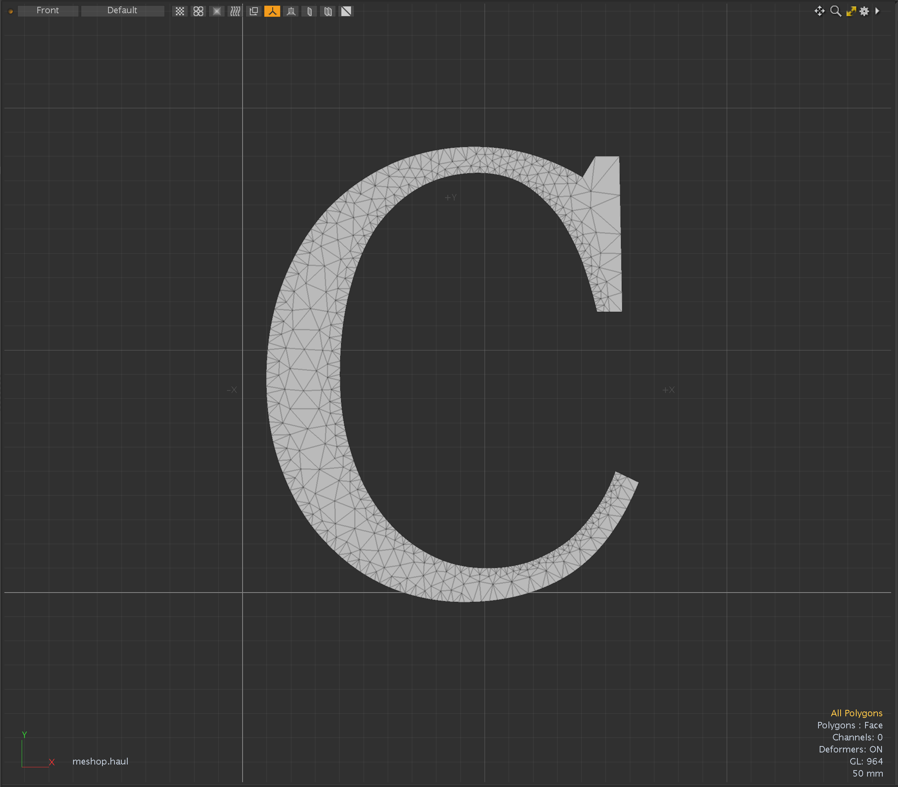
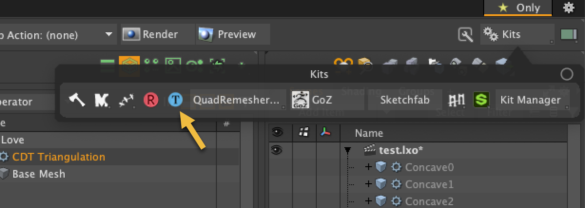

# CDT Triangulation for Modo plug-in
This is a Modo Plug-in kit to triangulate polygons using Constraint Delaunay Triangulation algorithm.

This kit contains a command plugin and a procedural mesh operator for macOS and Windows.

This kit is implemented using CGAL libraray.

https://cgal.org


<div align="left">

</div>
<div align="left">

</div>


## Installing
- Download lpk from releases. Drag and drop into your Modo viewport. If you're upgrading, delete previous version.

## How to use the plugins
- The command version of CDT Traingulation can be launched from "Kits" button on Modo UI at right-up. "poly.cdt" command is mapped at "T" button.  
- The procedural mesh operator version is available on Mesh Operator viewport. That is categorized in Polygon tab.
<div align="left">

</div>

## Type Option
- **Constrained Delaunay Triangulations**: force edges into Delaunay triangulation
- **Conforming Delaunay Triangulations**: add new points into Delaunay triangulation until the edge is present in triangulation

## Quad Rule
Quad Rule specifies how to split convex quad polygons.  <bt>
- **Split 1 to 3**: Split the quads on their 1st and 3rd vertices <bt>
- **Split 2 to 4**: Split the quads on their 2nd and 4th vertices <bt>
- **Shortest Diagonal**: Split the quads along their shortest diagonal <bt>
- **Longest Diagonal**: Split the quads along their longest diagonal <bt>

## Maximum Edge Size
How to set the maximum edge size of triangle for the quality of Conforming Delaunay Triangulations<bt>
- **By Ratio**: Related ratio of source polygon size <bt>
- **By Length**: Absolute edge length of triangle <bt>

## Scale and Size
- **Scale**: Scale for **By Ratio** <bt>
- **Size**: Size for **By Length** <bt>

## Minumum Angle
The minumum angle of triangle for the quality of Conforming Delaunay Triangulations.<bt>

## Dependencies

- LXSDK  
This kit requires Modo SDK (Modo 16.1v8 or later). Download and build LXSDK and set you LXSDK path to LXSDK_PATH in CMakeLists.txt in triagulate.
- CGAL library 6.0.1 (https://github.com/cgal/cgal)  
This also requires CGAL library. Download and CGAL from below and set the include and library path to CMakeLists.txt in triagulate.
- Boost 1.87.0 (https://www.boost.org/)
- GMP 6.3.0 (https://gmplib.org/)
- MPFR 4.2.1 (https://https://www.mpfr.org/)


## License

```
This software is based part on CGAL (The Computational Geometry Algorithms Library):
Licensed under the GPL-3.0 license.
https://cgal.org
```
